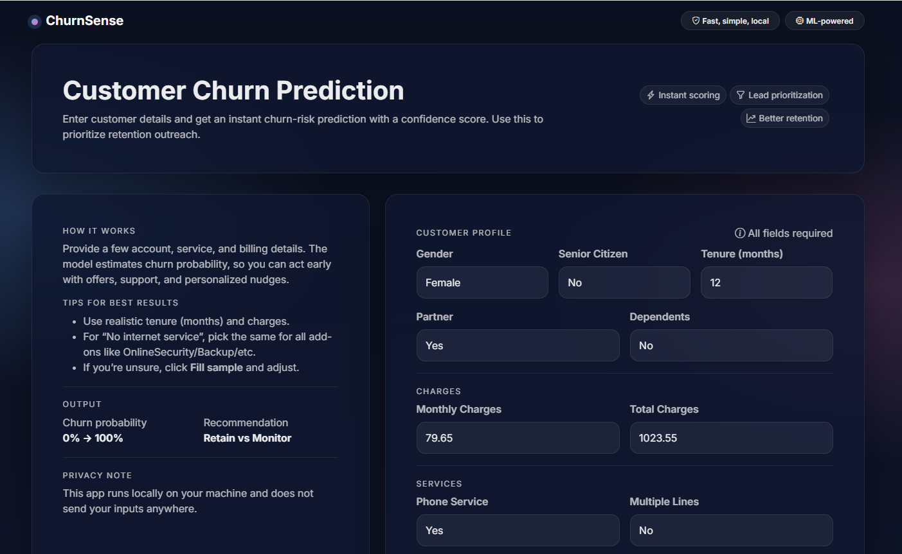
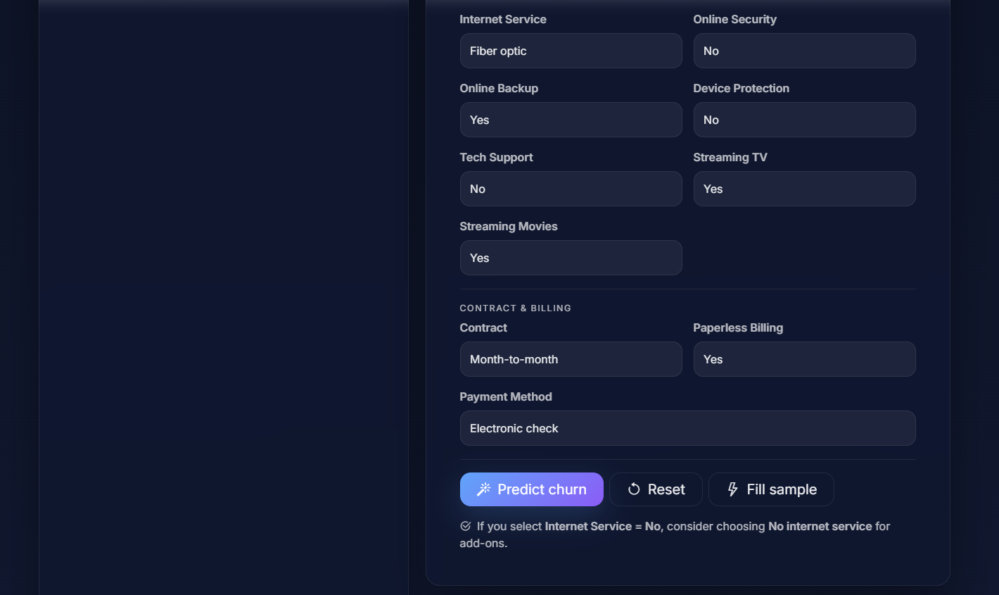
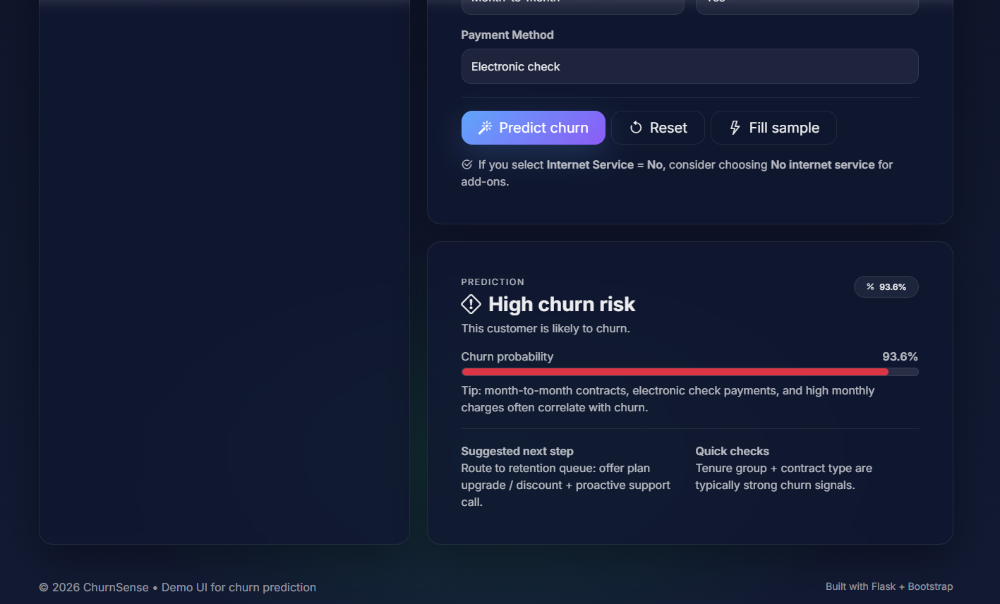

## Telco Customer Churn Prediction — Project Description (Detailed)

- **Goal:** Predict whether a telecom customer will **churn (leave the service)** so businesses can proactively target retention campaigns.
- **Approach:** Built an end-to-end pipeline covering **EDA → preprocessing/feature engineering → model training & evaluation → deployment**.

### Dataset
- Used the Telco churn dataset with **binary target `Churn`**.
- Observed **class imbalance**: ~**73.46% non-churn** vs **26.54% churn**.

### Exploratory Data Analysis (EDA) Highlights
- **Charges & tenure distribution**
  - Average **MonthlyCharges ~ $65**, with 75th percentile around **$90**.
  - Majority of customers have shorter tenure (75% customers have tenure < ~55 months).
- **High churn patterns (strongly associated with churn)**
  - **Month-to-month contracts**
  - **Electronic check** payment method
  - **Fiber optic** internet service
  - **No Online Security** and **No Tech Support**
  - **First year of subscription** / **low tenure**
- **Low churn patterns**
  - **Long-term contracts** (1–2 year)
  - **No internet service**
  - Customers engaged for **5+ years**
- **Low / negligible impact features** (as observed in EDA)
  - **Gender**, **PhoneService**, and **MultipleLines** showed minimal impact on churn.

### Feature Engineering & Preprocessing
- Converted **`TotalCharges`** to numeric (`errors='coerce'`) and **dropped missing rows** produced by coercion.
- Created a **`tenure_group`** feature by binning tenure into **12-month intervals**.
- Dropped non-predictive identifiers: **`customerID`** and the original **`tenure`** (after creating `tenure_group`).
- Converted target: **`Churn` → Yes:1 / No:0**.
- One-hot encoded categorical features using **`pd.get_dummies()`**.
- Ensured boolean dummy columns are numeric by casting boolean columns to **int**.
- Saved the cleaned + encoded modeling dataset as:
  - `Churn_Analysis/churn_dat_mod.csv`

### Modeling & Evaluation
- Split data into train/test using **80/20** split.
- Trained baseline models:
  - **Decision Tree Classifier** (gini, max_depth=6, min_samples_leaf=8)
  - **Random Forest Classifier** (100 trees, gini, max_depth=6, min_samples_leaf=8)
- Since the dataset is imbalanced, focused on **precision/recall/F1 for churn class** (instead of accuracy alone).
- Applied imbalance handling using **SMOTEENN** (oversampling + ENN cleaning).
- Tested **PCA** (90% variance retained), but it **did not improve performance**.
- Finalized the best-performing model:
  - **Random Forest + SMOTEENN**

### Key Results (from notebook runs)
- **Baseline Decision Tree**
  - Accuracy ~0.767; churn (Class 1) F1 around ~0.57
- **Baseline Random Forest**
  - Accuracy ~0.779; churn (Class 1) F1 around ~0.50
- **Decision Tree + SMOTEENN**
  - Accuracy ~0.930; churn (Class 1) precision/recall/F1 all ~0.92–0.95 range
- **Random Forest + SMOTEENN (Final)**
  - Accuracy ~**0.949**
  - Churn (Class 1) **Precision ~0.94, Recall ~0.98, F1 ~0.96**
- **Random Forest + PCA**
  - Accuracy dropped significantly (~0.741), so PCA was not used.

### Model Export
- Saved the trained final model as:
  - `model.sav` (pickle)

---

## How to Run the Flask App (Deployment)

- **Prerequisites:** Python 3.x, pip
- **Install dependencies:**
  - (Option A) If you have `requirements.txt`:
    - `pip install -r requirements.txt`
  - (Option B) Minimum typical packages:
    - `pip install flask pandas numpy scikit-learn imbalanced-learn`

- **Project files needed (typical):**
  - `app.py`
  - `model.sav`
  - `first_telc.csv` (reference columns file used by the app for feature alignment)
  - `templates/home.html`

- **Run the app:**
  - `python app.py`

- **Open in browser:**
  - `http://127.0.0.1:5000/`

- **Optional (if you prefer flask CLI):**
  - `set FLASK_APP=app.py` (Windows) / `export FLASK_APP=app.py` (Mac/Linux)
  - `flask run`
 
- Below are the images of the App in use
  
  
  
