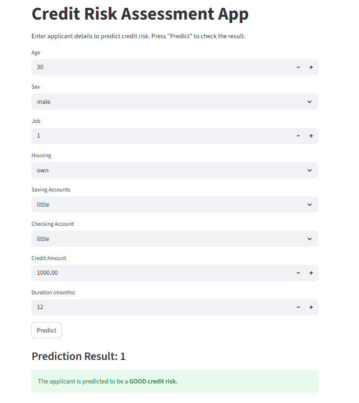

# Credit Risk Analysis + Streamlit App

This project builds an end-to-end **credit risk classification** pipeline using the German credit dataset (`german_credit_data.csv`) and deploys the best-performing model in a lightweight **Streamlit web app** for interactive predictions. The notebook covers data cleaning (handling missing values, dropping unused columns), exploratory analysis (distributions, risk-wise comparisons, categorical breakdowns, correlations), feature engineering (label encoding for key categorical fields), and model training with hyperparameter tuning. Multiple classifiers are evaluated via `GridSearchCV`, and the final tuned model is exported along with the fitted encoders to ensure consistent preprocessing at inference time.

---

## What’s inside

- **Notebook (modelling + analysis)**  
  - Loads `german_credit_data.csv`
  - Checks missing values/duplicates, drops null rows, removes unnecessary columns (e.g., index-like columns)
  - EDA: histograms, boxplots by risk, countplots for categorical variables, correlation heatmaps
  - Selects a compact feature set for modelling + deployment:
    - `Age`, `Sex`, `Job`, `Housing`, `Saving accounts`, `Checking account`, `Credit amount`, `Duration`
  - Encodes categorical columns using **LabelEncoder** and persists encoders for reuse
  - Trains and tunes multiple models (Decision Tree, Random Forest, Extra Trees, XGBoost) using **5-fold CV**
  - Saves the best tuned model artifact as `best_xgb_model.pkl`

- **Streamlit app (`Cred_Risk_app.py`)**
  - Loads the saved model `best_xgb_model.pkl`
  - Loads saved encoders for: `Sex`, `Housing`, `Saving accounts`, `Checking account`
  - Takes user inputs and outputs a prediction:
    - `1` → **Good (lower risk)**
    - `0` → **Bad (higher risk)** :contentReference[oaicite:0]{index=0}
  - Transforms inputs using the same encoders used during training, then runs inference :contentReference[oaicite:1]{index=1}

---

## Tech Stack

- Python
- pandas, numpy
- matplotlib, seaborn (EDA/visualization)
- scikit-learn (preprocessing, model evaluation, tuning)
- xgboost (final model)
- joblib (model + encoder persistence)
- streamlit (deployment UI) :contentReference[oaicite:2]{index=2}

---

## How to run locally

### 1) Clone the repo & create a virtual environment
```bash
git clone <your-repo-url>
cd <your-repo-folder>

python -m venv .venv
# Windows:
.venv\Scripts\activate
# macOS/Linux:
source .venv/bin/activate
