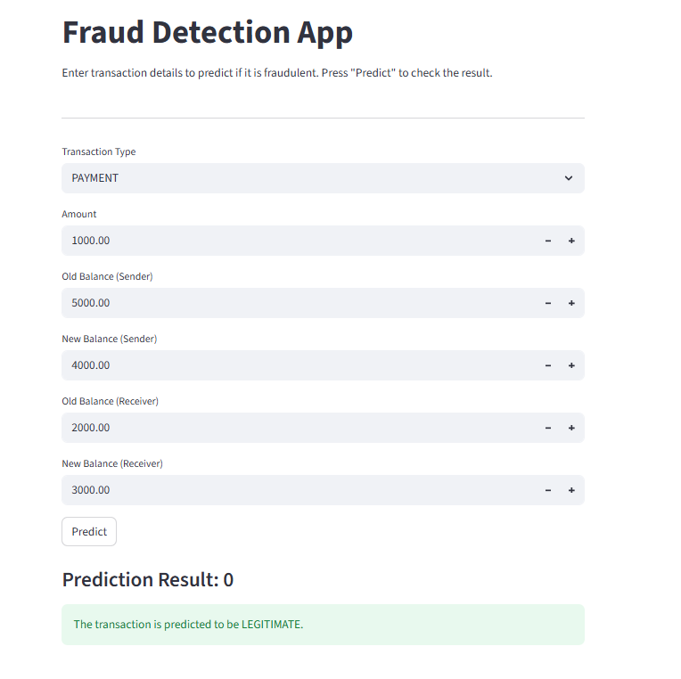

# Fraud Detection Pipeline


## Project Overview
- This project builds an end-to-end **fraud detection pipeline** for financial transactions and deploys it as an interactive **Streamlit web app**.
- The workflow includes:
  - **Exploratory Data Analysis (EDA)** to understand transaction patterns, fraud distribution, and anomalies.
  - **Feature preparation + modelling** using a reproducible `scikit-learn` **Pipeline** (preprocessing + classifier).
  - **App deployment** where users enter transaction details and instantly receive a fraud/legit prediction.

---

## Dataset
- The notebook uses a CSV dataset (`AIML_Dataset.csv`) with transaction-level fields such as:
  - `step` (time index), `type` (transaction type), `amount`
  - sender balances: `oldbalanceOrg`, `newbalanceOrig`
  - receiver balances: `oldbalanceDest`, `newbalanceDest`
  - target: `isFraud`
  - helper flag: `isFlaggedFraud`
- A key challenge identified in EDA is **severe class imbalance** (fraud is a very small fraction of all transactions), so the modelling step explicitly addresses imbalance using **class weighting**.

---

## EDA Highlights (Fraud_analysis_mod.ipynb)
- Checked overall fraud frequency and computed fraud percentage to understand imbalance.
- Visualized:
  - **Transaction-type distribution** and **fraud rate by type**
  - Amount patterns (including outlier behavior via boxplots)
  - Fraud variation over time (`step`)
- Performed anomaly-style exploration such as:
  - balance-change behavior (e.g., creating a derived feature like `balanceDiffOriginal = oldbalanceOrg - newbalanceOrig`)
  - patterns where balances drop to zero after certain transaction types (useful as fraud signals)

---

## Modelling Approach (Fraud_analysis_mod.ipynb)
- Prepared modelling dataset by dropping high-cardinality ID-like fields (`nameOrig`, `nameDest`) and `isFlaggedFraud`.
- Built a `scikit-learn` **Pipeline**:
  - **Numeric preprocessing:** `StandardScaler`
  - **Categorical preprocessing:** `OneHotEncoder` for transaction `type`
  - **Classifier:** `LogisticRegression(class_weight='balanced')` (to handle class imbalance)
- Train/test split used **stratification** to preserve fraud ratio in both sets.
- Evaluation included:
  - `classification_report` (precision/recall/F1)
  - `confusion_matrix`
  - overall test accuracy (`pipeline.score`)

---

## Streamlit App (fraud_detector.py)
- The Streamlit UI collects transaction inputs and runs prediction using a saved model pipeline.
- Inputs taken in the UI include: `type`, `amount`, `oldbalanceOrg`, `newbalanceOrig`, `oldbalanceDest`, `newbalanceDest`. :contentReference[oaicite:0]{index=0}
- The app loads the trained pipeline from `fraud_detection_model.pkl` and predicts directly on a single-row DataFrame. :contentReference[oaicite:1]{index=1}
- Output is shown clearly as either **FRAUDULENT** or **LEGITIMATE** with Streamlit alerts. :contentReference[oaicite:2]{index=2}

---

## How to Run Locally

### 1) Set up environment
```bash
python -m venv venv
# Windows:
venv\Scripts\activate
# Mac/Linux:
source venv/bin/activate
